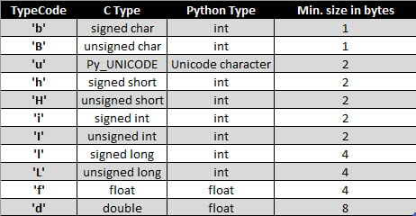

# Arrays Revision
In Python we can use array by two ways
* Python Array Module
* Python Numpy Module

I have discussed both the modules here:

## Python Array Module
In python array module we import array module and while declaring an array we declare a typecode which is shown in the below image 



```
Python Code Example 

import array as arr

val = arr.array(typecode,[list of value of same types])
```

## Python Numpy Module
To be updated 
